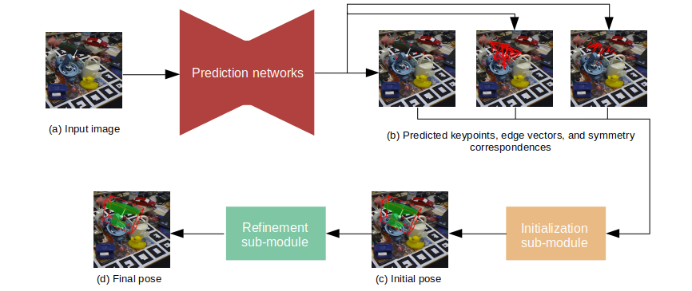

# HybridPose: 6D Object Pose Estimation under Hybrid Representations
This repository contains authors' implementation of [HybridPose: 6D Object Pose Estimation under Hybrid Representations](https://arxiv.org/abs/2001.01869). Our implementation is based on [PVNet](https://github.com/zju3dv/pvnet).
We warmly welcome any discussions related to our implementation and our paper. Please feel free to open an issue.

**Important notice:** We were informed by some readers that the training/testing split used in our experiment is inconsistent with baseline models. The comparison to baseline methods is therefore controversial. I am actively working on re-evaluating our approach. The updates will be posted to both this GitHub directory. At this point, I kindly request readers to focus on the general architecture of our method, and the relative strength of hybrid representations as demonstrated by the ablation study. I apologize for the inconvenience this may have caused.

**News (June 11, 2020):** We have fixed a bug in Linemod dataset labeling as pointed out by [JISock](https://github.com/JISock) in [this issue](https://github.com/chensong1995/HybridPose/issues/3), and [shanniruo](https://github.com/shanniruo) in [this issue](https://github.com/chensong1995/HybridPose/issues/25). A small offset was incorrectly added to the translation vectors on Linemod dataset. Links to new labels and pre-trained weights are updated below. Our bug fix leads to marginal improvement of average ADD(-S) accuracy: from 0.9450447652 to 0.945402139. Thank you, JISock and shanniruo!

## Introduction
HybridPose consists of intermediate representation prediction networks and a pose regression module. The prediction networks take an image as input, and output predicted keypoints, edge vectors, and symmetry correspondences. The pose regression module consists of a initialization sub-module and a refinement sub-module. The initialization sub-module solves a linear system with predicted intermediate representations to obtain an initial pose. The refinement sub-module utilizes GM robust norm to obtain the final pose prediction.


## Download
```
git clone --recurse-submodules git@github.com:chensong1995/HybridPose.git
```

## Environment set-up
Please install [Anaconda](https://www.anaconda.com/distribution/) first and execute the following commands:
```
conda create -y --name hybridpose python==3.7.4
conda install -y -q --name hybridpose -c pytorch -c anaconda -c conda-forge -c pypi --file requirements.txt
conda activate hybridpose
```

## Compile the Ransac Voting Layer
The Ransac Voting Layer is used to generate keypoint coordinates from vector fields. Please execute the following commands (copied from [PVNet](https://github.com/zju3dv/pvnet)):
```
cd lib/ransac_voting_gpu_layer
python setup.py build_ext --inplace
```

## Compile the pose regressor
The pose regressor is written in C++ and has a Python wrapper. Please execute the following commands:
```
cd lib/regressor
make
```

## Dataset set-up
We experimented HybridPose on Linemod and Occlusion Linemod. Let us first download the original datasets using the following commands:
```
python data/download_linemod.py
python data/download_occlusion.py
```
Let us then download our augumented labels to these two datasets. Our augumented labels include:
* Keypoints: both 2D and 3D coordinates. These labels are generated using [FSP](https://github.com/zju3dv/pvnet/blob/master/lib/utils/data_utils.py).
* Symmetry: Symmetry correspondences in 2D and the normal of symmetry plane in 3D. These labels are generated using [SymSeg](https://github.com/aecins/symseg).
* Segmentation masks: On Linemod, we create segmentation masks by projecting 3D models. On Occlusion Linemod, we use the segmentation masks provided in [PVNet](https://github.com/zju3dv/pvnet).

They are uploaded here:
* Google Drive: [Linemod](https://drive.google.com/file/d/1oSM-5ily_vkQ28KVpW7q5FyY67A7Jt1N/view?usp=sharing), [Occlusion Linemod](https://drive.google.com/file/d/1PItmDj7Go0OBnC1Lkvagz3RRB9qdJUIG/view?usp=sharing).
* Tencent Weiyun: [Linemod](https://share.weiyun.com/OPxLstUw), [Occlusion Linemod](https://share.weiyun.com/50i7KTb).

The following commands unzip these labels to the correct directory:
```
unzip data/temp/linemod_labels.zip -d data/linemod
unzip data/temp/occlusion_labels.zip -d data/occlusion_linemod
```

## Training
Please set the arguments in src/train\_core.py execute the following command (note that we need to set LD\_LIBRARY\_PATH for the pose regressor):
```
# on bash shell
LD_LIBRARY_PATH=lib/regressor:$LD_LIBRARY_PATH python src/train_core.py
# on fish shell
env LD_LIBRARY_PATH="lib/regressor:$LD_LIBRARY_PATH" python src/train_core.py
```
If you use a different shell other than bash and fish, prepend "lib/regressor" to LD\_LIBRARY\_PATH and run `python src/train_core.py`.

## Pre-trained weights
You can download our pre-trained weights below:
* Linemod (Google Drive): [ape](https://drive.google.com/file/d/1LOUfdaffqMzocuTDMG6rMtJgZyQiG2hR/view?usp=sharing),
[benchviseblue](https://drive.google.com/file/d/1nJ8H4s0CgbVK_qJJFT6_zZJX-glCHwkr/view?usp=sharing),
[cam](https://drive.google.com/file/d/1EgUy8tPDl4EwiIrLP_ZGBzTG2xFEWktw/view?usp=sharing),
[can](https://drive.google.com/file/d/146c2swIc7YhCY47b-GN7oCOyyBXm4RYH/view?usp=sharing),
[cat](https://drive.google.com/file/d/1i6fO0e-ixvG37nbQde_71WpofNngYeQt/view?usp=sharing),
[driller](https://drive.google.com/file/d/1SWk6Nh36BGnYKGxAPmRV3y3TfpWLQesu/view?usp=sharing),
[duck](https://drive.google.com/file/d/12nr6s9sJ6o3MlswsNm1DAZNwiDsfNkCr/view?usp=sharing),
[eggbox](https://drive.google.com/file/d/1YHDXB4vlEAwOB3vOUnRbO2XALlFc1kEF/view?usp=sharing),
[glue](https://drive.google.com/file/d/1hfHUJA17hJ0ZDQdq5gLVw2Q6Vm7xDbY1/view?usp=sharing),
[holepuncher](https://drive.google.com/file/d/1SGAjHHCGrNNgSigN_Db7quE8LIIMmvBO/view?usp=sharing),
[iron](https://drive.google.com/file/d/1p5hXKpBG4fBrV5vwIoNnIA83E8fFrpfa/view?usp=sharing),
[lamp](https://drive.google.com/file/d/1smye1JnM6kS0PNsAZkeuo5LfU7FPl2pD/view?usp=sharing),
[phone](https://drive.google.com/file/d/14kRJ2VeSfEd1gxOLrUzpRJoPsycKKjQt/view?usp=sharing)
* Linemod (Tencent Weiyun): [ape](https://share.weiyun.com/kD3EgEsn),
[benchviseblue](https://share.weiyun.com/Fd4kovRM),
[cam](https://share.weiyun.com/wwZpx9Kb),
[can](https://share.weiyun.com/bqIuvUUW),
[cat](https://share.weiyun.com/w1wsESru),
[driller](https://share.weiyun.com/Hdt4u9yt),
[duck](https://share.weiyun.com/Rg33nf1s),
[eggbox](https://share.weiyun.com/VKRXInIk),
[glue](https://share.weiyun.com/xBFlmV5d),
[holepuncher](https://share.weiyun.com/pr8oCZFF),
[iron](https://share.weiyun.com/EO3TQzJO),
[lamp](https://share.weiyun.com/sUrdYx5R),
[phone](https://share.weiyun.com/EGOvgGlH)
* Occlusion Linemod (Google Drive): [ape](https://drive.google.com/file/d/1JeBETMGgELrawzofO59j4OCpg-2tf3iy/view?usp=sharing),
[can](https://drive.google.com/file/d/1Cl47bGiPyodHNqITaxCadFAT97YP7nl9/view?usp=sharing),
[cat](https://drive.google.com/file/d/1gDMwqPuFyKg_YW_PbqY_yT53dJEYYrqW/view?usp=sharing),
[driller](https://drive.google.com/file/d/1iAvptsTtwHVp6bNNSRBl5QiVi3O8uDeo/view?usp=sharing),
[duck](https://drive.google.com/file/d/1GwmhyWG4czIsVcCRyWA19ZEZfTzEN2Wo/view?usp=sharing),
[eggbox](https://drive.google.com/file/d/1UKl6aSLRVZzbjI1b5yhxBRlavI8n_JMb/view?usp=sharing),
[glue](https://drive.google.com/file/d/1JnABWWuNns_syYO-zPUBGViT_HWt0VAW/view?usp=sharing),
[holepuncher](https://drive.google.com/file/d/1XGt5BvYEbVN67zZbdMaGBsaC2-pad4zv/view?usp=sharing)
* Occlusion Linemod (Tencent Weiyun): [ape](https://share.weiyun.com/5t8BCmi),
[can](https://share.weiyun.com/5IgRL6W),
[cat](https://share.weiyun.com/5i50fIb),
[driller](https://share.weiyun.com/52GAoma),
[duck](https://share.weiyun.com/5pkx7dB),
[eggbox](https://share.weiyun.com/5XBQ8IY),
[glue](https://share.weiyun.com/5p2aIzV),
[holepuncher](https://share.weiyun.com/5cR5b88)

~We have configured random seeds in src/train\_core.py and expect you to re-produce identical weights by running our training script.~ It turns out that [completely reproducible results are not guaranteed across PyTorch releases, individual commits or different platforms. Furthermore, results need not be reproducible between CPU and GPU executions, even when using identical seeds.](https://pytorch.org/docs/stable/notes/randomness.html) Our training uses two graphics cards with a batch size of 12.

After you download the pre-trained weights, unzip them somewhere and configure `--load_dir` in `src/train_core.py` to the unzipped weights (e.g. `saved_weights/occlusion_linemod/ape/checkpoints/0.02/499`).

Running `src/train_core.py` now will save both ground truth and predicted poses to a directory called `output`.

## Evaluation
To evaluate ADD(-S) accuracy of predicted poses, please set the arguments in `src/evaluate.py` and run
```
python src/evaluate.py
```

## Citation
If you find our work useful in your research, please kindly make a citation using:
```
@misc{song2020hybridpose,
    title={HybridPose: 6D Object Pose Estimation under Hybrid Representations},
    author={Chen Song and Jiaru Song and Qixing Huang},
    year={2020},
    eprint={2001.01869},
    archivePrefix={arXiv},
    primaryClass={cs.CV}
}
```
